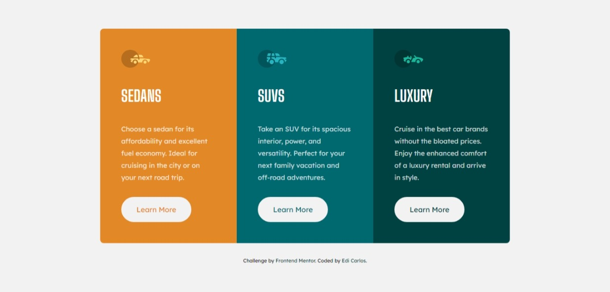

# Frontend Mentor - 3-column preview card component solution

This is a solution to the [3-column preview card component challenge on Frontend Mentor](https://www.frontendmentor.io/challenges/3column-preview-card-component-pH92eAR2-)

## Table of contents

- [Overview](#overview)
  - [Screenshot](#screenshot)
  - [Links](#links)
- [My process](#my-process)
  - [Built with](#built-with)
- [Author](#author)

## Overview

### Screenshot

### Links

- Solution URL: [Github repo](https://github.com/ediCarlosSilva/3-column-preview-challenge)
- Live Site URL: [Website](https://edicarlossilva.github.io/3-column-preview-challenge/)

## My process

### Built with

- Semantic HTML5 markup
- CSS custom properties
- Flexbox
- CSS GRID
- Mobile-first workflow
- [SCSS](https://sass-lang.com/) - SCSS
- [Gulp](https://gulpjs.com/) - A toolkit to automate & enhance your workflow

### tools

- Color picker (PowerToys Microsoft)
- Pixel Ruler (PowerToys Microsoft)
- vscode

## Author

- Website - [Edi Carlos](https://edicarlossilva.github.io)
- Frontend Mentor - [@ediCarlosSilva](https://www.frontendmentor.io/profile/ediCarlosSilva)
